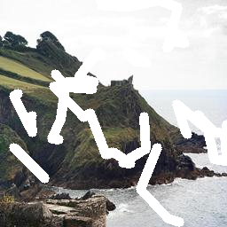

# Image Inpainting via Generative Multi-column Convolutional Neural Networks

Original README is [here](https://github.com/shepnerd/inpainting_gmcnn).

## Results:

original | masked | output
| -- | -- | -- |
|  |  |  |